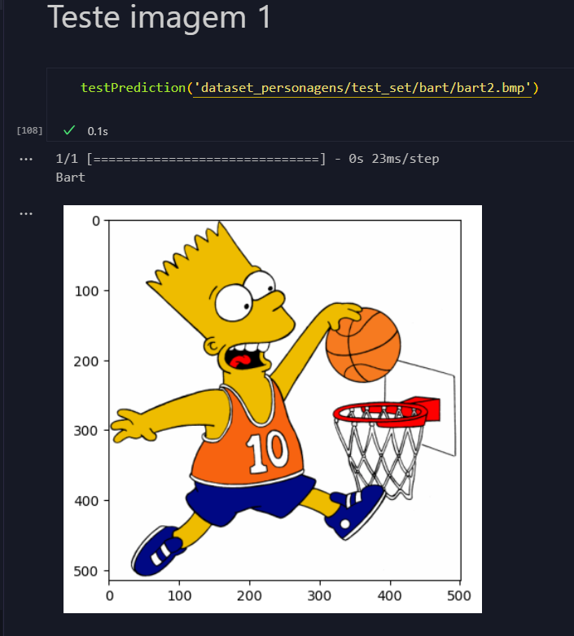

# Lista EXTRA 2 - CNN

## Aluno: Henrique França Carvalho Soares

### Modificações e Análise da Rede Neural Convolucional

[Link para acesso ao código](https://github.com/HenriqueSoares28/CNN_homer_bart)

**Arquitetura da CNN com alterações:**
1. **Inicialização da Rede**: A rede é inicializada como um modelo sequencial usando `Sequential()`.

2. **Primeira Camada de Convolução**: A CNN começa com uma camada de convolução `Conv2D` com 64 filtros e um kernel de tamanho (5, 5). A função de ativação é 'relu'. Esta configuração ajuda a rede a capturar características mais complexas logo no início.

3. **Primeira Camada de Pooling e Dropout**: Segue-se uma camada de pooling `MaxPooling2D` com um tamanho de pool de (2, 2) para reduzir a dimensionalidade espacial. Uma camada de `Dropout` com taxa de 0.5 é adicionada para evitar overfitting.

4. **Segunda Camada de Convolução**: Uma segunda camada de `Conv2D` com 64 filtros e um kernel de tamanho (3, 3) é utilizada, seguida por outra camada de pooling e dropout com as mesmas configurações.

5. **Flattening**: Após as camadas de convolução e pooling, a camada `Flatten` transforma os dados em um formato unidimensional para as próximas camadas densas.

6. **Camada Totalmente Conectada**: Uma camada densa `Dense` com 256 unidades é utilizada, seguida por uma camada de saída com uma unidade e função de ativação 'sigmoid', indicando uma abordagem de classificação binária.

7. **Compilação da Rede**: A rede é compilada com o otimizador 'adam' e a função de perda 'binary_crossentropy', que é adequada para tarefas de classificação binária.

**Desempenho e Resultados:**
Os resultados do treinamento mostram um padrão variável de precisão e perda ao longo das épocas, com a acurácia alcançando até 78.05% no conjunto de treino e 85.94% no conjunto de validação. Isso sugere uma capacidade moderada do modelo de generalizar para novos dados.

**Conclusão:**
**Conclusão Aperfeiçoada:**

As alterações implementadas na arquitetura da Rede Neural Convolucional (CNN), que incluíram o aumento do número de filtros nas camadas convolucionais, a introdução de camadas de dropout para prevenir o overfitting, e a expansão do número de neurônios na camada densa, foram estratégias visando amplificar a capacidade de aprendizado da rede. Os resultados obtidos indicam que a rede aprimorada demonstra uma habilidade efetiva de capturar e aprender padrões complexos presentes nos dados.

 

